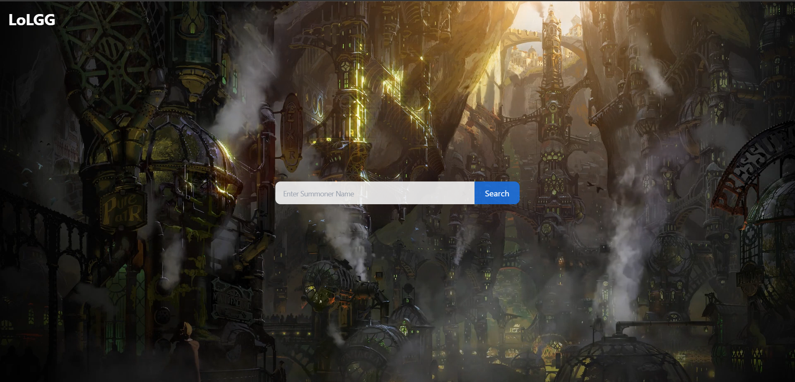

# LoLGG

### Installation

```
git clone https://github.com/Steelataure/LoLGG.git
```
In the root folder
```
python ./manage.py runserver
```

### Overview


### In Progress

The website is under development and not yet available online